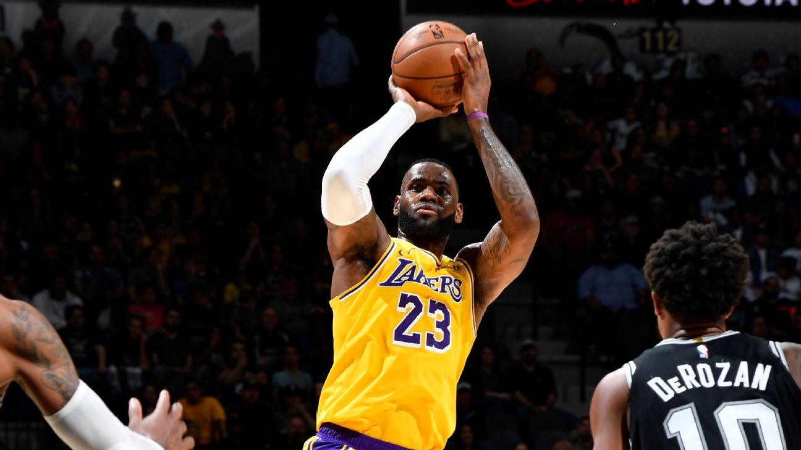
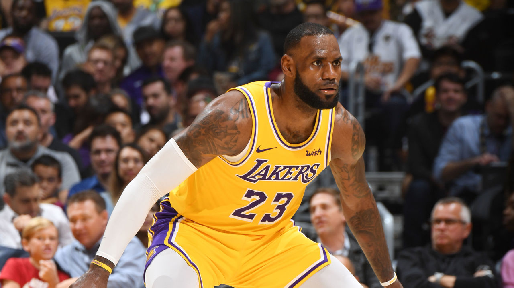

<h2>Intro</h2>

    Lebron James is one of the best players in the NBA and the star player of the Los Angeles Lakers. He has been been praised for playing an inclusive brand of basketball, always involving his teammates, while playing high-level defense and contributing efficiently in many aspects in the game of basketball. His hardwork and ability to work with others has led him to win 3 NBA championships, 4 MVP awards, and 2 Olympic gold medals.

    One of the most signficant indicators of a player's success is their +/- rating, a statistic that measures the difference in one team's scoring and the opponent team's scoring while the player is in the game.

<h2>Machine Learning</h2>

    The goal of this project is to use machine learning to predict the +/- rating for Lebron's games based on several factors such as points scored, PER, rebounds, steals, blocks, and many more. There are two machine learning iterations, which include two rounds of feature engineering and testing machine learning models.

    The feature engineering includes cross-referencing features to create new numerical features while also comparing those numerical features to certain thresholds to create categorical features. The features are evaluated based off their correlation with the target (+/-) feature and the p-value from ANOVA tests and T-Tests.

    The machine learning includes testing several algorithms such as Linear Regression, SGD Regression, Random Forest Regression, and Elastic Net Regression. Moreover, each machine learning iteration includes one section that does not used PCA to reduce the dimensionality of the data and one section that does use PCA. 

<h3>Results</h3>

    The model was the linear regression model that include one-hot-encoded data about which opposing team Lebron was facing and no PCA reduction. This model had a root mean squared error (rmse) of 6.422 points.

It should be noted that +/- is not a wholistic explanation of the performance of one player. Lebron James has played about 17 years in the NBA and many different rosters. Therefore, some of the error could be explained by the fact that some years Lebron has had less skilled teammates; therefore, even when he has an efficient game, having less skilled teammates may still lead to a lower +/- rating.

<h2>Data Collection</h2>

    The data was collected from Basketball Reference, a website that contains information about each game in NBA history. I used BeautifulSoup, a Python package used for parsing HTML and XML documents. I also used the requests library to make HTTP requests and access Basketball Reference's websites as html files.

    This data was inserted into Pandas Dataframes and saved in a data folder as CSV files.

<h2>Data Visualization</h2>

    The data visualization process is broken up into two major parts: the basic offensive analysis, in-depth offensive scoring efficiency analysis, and defensive analysis. 

<h3>Basic Offensive Analysis</h3>

    The basic offensive analysis visualizes Lebron's points per game, assists per game, total rebounds per game, and field goal percentage. I analyzed the distribution of these statistics, outliers, and overall trends.

<h3>In-depth Offensive and Scoring Efficiency Analysis</h3>

    This section visualizes more specific statistics which are percentages and rebounds. It shows point plots that show his offensive progression over the course of his career, box plots to show outliers, and bifurcated plots to analyze how certain trends change at different ages. 

<h3>Defense</h3>

    This section demonstrates how effective Lebron was at making steals, blocking, and avoiding personal fouls.

